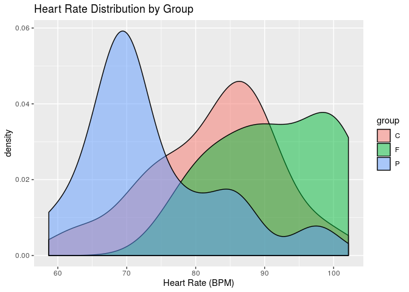

HW 02: Analysis of Variance
================
Your Name
2019-09-23

## Load packages

``` r
library(tidyverse)
library(broom)
library(knitr) 
```

## Part 1: Computations & Concepts

### Question 1

``` r
dfw <- 125 # degrees of freedom within (residuals)
dft <- 130 # total degrees of freedom
ssw <- 6.486 # sum of squares within (residuals)
sst <- 19.386 # total sum of squares
dfb <- 5 # degrees of freedom between (model)
ssb <- 12.9 # sum of squares between (model)
msb <- 2.58  # mean square between
msw <- 0.0519  # mean square within (residuals)
f_stat <- 49.722  #F -statistic 
p_val <- 1-pf(49.722, 5, 125)  # F-Statistic, DF1, DF2
```

``` r
source <- c("Between Groups", "Within Groups", "Total")
df <- c(dfb, dfw,dft)
ss <- c(ssb, ssw, sst)
ms <- c(msb, msw,NA)  
f.statistic <- c(f_stat, NA, NA)
p.value <- c(p_val,NA,NA)

# combine the columns to make a table called "anova"
anova <- bind_cols("Source"=source,"df"=df,"Sum of squares"=ss,"Mean square"=ms,"F-statistic"=f.statistic,"p-value"=p.value)

# print the table 
kable(anova) 
```

| Source         |  df | Sum of squares | Mean square | F-statistic | p-value |
| :------------- | --: | -------------: | ----------: | ----------: | ------: |
| Between Groups |   5 |         12.900 |      2.5800 |      49.722 |       0 |
| Within Groups  | 125 |          6.486 |      0.0519 |          NA |      NA |
| Total          | 130 |         19.386 |          NA |          NA |      NA |

### Question 2

There are 131 observations are in the dataset. DF total (130) is n-1, so
n=131.

There are 6 groups being compared. DF between (5) is K-1, so K=6.

### Question 3

The estimate of σ2 is the mean square within (MSW). The MSW is 0.0519,
and it measures the variance within each group.

### Question 4

The null hypothesis states there is no statistically significant
difference between the means in across the 6 groups. The alternative
hypothesis states there is at least one mean in the 6 groups that is
statistically significantly different from the others.

H0: μ1=μ2=μ3=μ4=μ5=μ6

Ha: At least one μ is not equal to the others

### Question 5

The p-value of 0 is less than the alpha level 0.05, therefore we reject
the null hypothesis, in favor of the alternative hypothesis. There is at
least one mean in the 6 groups that is not equal to the others.

## Part 2: Data Analysis

### Question 6

``` r
stress_data <- read_csv("data/stress-experiment.csv")
```

#### Exploratory Data Analysis

Create side-by-side boxplots to visualize distribution of heart rate by
group (control, friend present, pet
present).

``` r
ggplot(data = stress_data, mapping = aes(y = heart_rate, x = group)) + geom_boxplot() + labs(title = "Distribution of Heart Rate by Group", x = "Group", y = "Heart Rate")
```

<!-- -->

Create density plot to show distribution of heart rate by group.

``` r
ggplot(data = stress_data, aes(x = heart_rate, fill = group)) +
  geom_density(alpha = 0.5) + 
  labs(title = "Heart Rate Distribution by Group", 
       x = "Heart Rate", 
       color = "Group")
```

<!-- -->

Summarize mean and variance for each group.

``` r
stress_data %>%
  group_by(group) %>%
  summarise(mean = mean(heart_rate), variance=var(heart_rate))
```

    ## # A tibble: 3 x 3
    ##   group  mean variance
    ##   <chr> <dbl>    <dbl>
    ## 1 C      82.5     85.4
    ## 2 F      91.3     69.6
    ## 3 P      73.5     99.4

#### Assumptions

Normality is not satisfied because the density plot distributions are
not normal for any group. The ‘control’ and ‘friend present’ group
distributions are skewed left, and the ‘pet present’ group distribution
is skewed right.

Equal (Constant) Variance is satisfied because we see that none of the
groups’ variances are more than four times the other variances.

Independence is satisfied because one woman’s heart rate/stress response
does not affect another’s. The observations are independent subjects who
have no influence on each other.

#### Hypotheses

The null hypothesis is there is no statistically significant difference
in mean heart rate between the groups of women. The alternative
hypothesis is there is at least one mean heart rate that is
statistically significantly different thatn the others.

H0: μ1=μ2=μ3

Ha: At least one μ is not equal to the others

#### ANOVA Test

``` r
heartrate_anova <- aov(heart_rate ~ group, data = stress_data)
tidy(heartrate_anova) %>% kable(format = "markdown", digits = 5)
```

| term      | df |    sumsq |     meansq | statistic | p.value |
| :-------- | -: | -------: | ---------: | --------: | ------: |
| group     |  2 | 2387.689 | 1193.84450 |  14.07954 |   2e-05 |
| Residuals | 42 | 3561.299 |   84.79285 |        NA |      NA |

The p-value of 0.00002 is less than the alpha level 0.05, so we reject
the null hypothesis, in favor of the alternative hypothesis that there
is at least one mean heart rate that is statistically significantly
different than the others. Thus, there is evidence of an association
between the presence of a friend or pet and stress level when completing
difficult tasks.

The estimate of σ2 is the mean square within (MSW). The MSW is 84.793,
and it measures the variance within each group.

``` r
n.groups <- stress_data %>%
  distinct(group) %>% 
  count()

crit.val <- qt(0.975, (nrow(stress_data)-n.groups$n))
sigma <- sqrt(84.79285)

conf.intervals <- stress_data %>%
  group_by(group) %>% 
  summarise(mean = mean(heart_rate), n = n(), 
            lower = mean - crit.val * sigma/sqrt(n),
            upper = mean + crit.val * sigma/sqrt(n))
ggplot(data=conf.intervals,aes(x=group,y=mean)) +
  geom_point() + 
  geom_errorbar(aes(ymin = lower, ymax = upper), width = 0.1) + 
  labs(title="95% Confidence Interval for the Mean Value of Heart Rate", x = "Group", y = "Heart Rate", subtitle="by Group") +
  coord_flip()
```

<!-- -->

According to the confidence intervals for mean heart rate between
groups, women with a friend present tended to have higher heart rates
than the control group, and women with a pet present tended to have
lower heart rates than the control group.

``` r
library(pairwiseCI)
pairwiseCI(heart_rate ~ group, data = stress_data, method = "Param.diff", conf.level = 0.995, var.equal = TRUE)
```

    ##   
    ## 99.5 %-confidence intervals 
    ##  Method:  Difference of means assuming Normal distribution and equal variances 
    ##   
    ##   
    ##     estimate    lower  upper
    ## F-C    8.801  -0.9928 18.595
    ## P-C   -9.041 -19.7358  1.654
    ## P-F  -17.842 -28.0685 -7.616
    ##   
    ## 

The difference in means between ‘friend present’ and ‘pet present’
groups is the highest.

Due to evidence that a difference in means does exist, we can say that
when completing difficult tasks, women with a pet present tend to have
lower stress levels than women who do not, and women with a close friend
present tend to have higher stress levels.

However, we cannot conclude that pets or close friends cause different
stress levels. Normality is not satisfied so the assumptions for ANOVA
testing are not satisfied to make a definitive conclusion. There also
may be other confounding variables affecting stress levels in these
women. In addition, the sample size of only 45 women is very small to
make any conclusions.

### Overall (Do not delete\!)

You do not need to write anything for this question. We will check the
following as part of your lab grade:

  - 5 pt: Documents neatly organized (.Rmd and .md files)
  - 3 pt: Narrative in full sentences and neatly organized
  - 2 pt: Regular and informative commit messages
